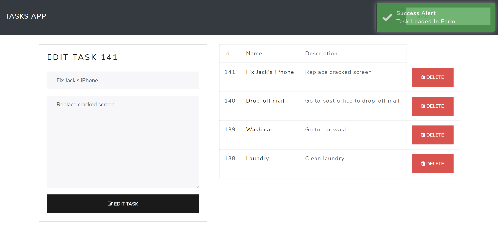

# Changes/Additions made to Todo-App (PHP-jQuery-AJAX)
- Fixed bug: When name/description had a single quote when Adding/Editing tasks, it would not be submitted since single quote was not being escaped. Made insert/update MySQLi prepared statements in task-add.php and task-edit.php, respectively, to resolve issue.
- Fixed bug: Clicking tasks listed in Search Results did not do anything. Fixed it so that it's now editable upon clicking.
- Fixed bug: After editing a task, the task form is stuck on editing, therefore making Adding Task unavailable. Fixed by resetting the edit flag after submitting the task form.
- Improved usability: Added "Search Results" header text to search results area
- Improved usability: Reworded "Save Task" button to "Add Task"
- Improved usability: When editing a task, reworded task form submit button to read 'Edit Task'. After editing task, button defaults to 'Add Task'
- Improved usability: Removed Search button since typing into Search input field auto-submits via AJAX post
- Fixed bug: Typing single quote in Search input field generates console error. Fixed by making search query a MySQLi prepared statement
- Improved search: Added SQL wildcard % before and after search value
- Improved spacing: Fixed spacing between task form, search results and task list. Reviewed/tested adjustment across viewport sizes.
- Improved usability: Made search input field visible in mobile viewport size
- Improved usability: Added success/error notifications when performing AJAX Editing, Deleting and Adding of Task.
- Improved usability: Added icons to buttons to improve usability
- Improved usability: Added header to task form to indicate when in Add or Edit mode
- Form validation added to Task Form
- Set max-length to form fields
- Applied bootstrap text-break to table data cells
- Enabled MYSQLI_CLIENT_FOUND_ROWS option in mysqli_real_connect so that it returns the number of found (matched) rows, not the number of changed rows. This is helpful for SQL Updates when no task changes were made.
- Limited the Tasks List to twenty tasks
- Fixed navbar wrapping on Chrome for iOS (navbar-expand on nav tag, ml-auto on wrapper for search field)
- activeElement and parentElement property on Chrome for iOS did not work. Use $(e.target) property as a fix. Added taskId attribute to delete input button as a result.
- Delete click button event was undefined when clicking on trash icon. Remove i tag and added icon tags to button as a fix.
- Auto-scroll to top of the page after clicking on task for editing. Improves usability on mobile.
- Added viewport meta tag to prevent zoom on mobile devices when input field is on focus.
- Set max-length to search field.
- Moved Search Results above Add/Edit Task form. This improves usability, especially on mobile.
- Updated bootstrap grid (col-md to col-lg) to collapse layout to one column when under larger desktops resolution. This improves usability on mobile.
- HTML encoded output
